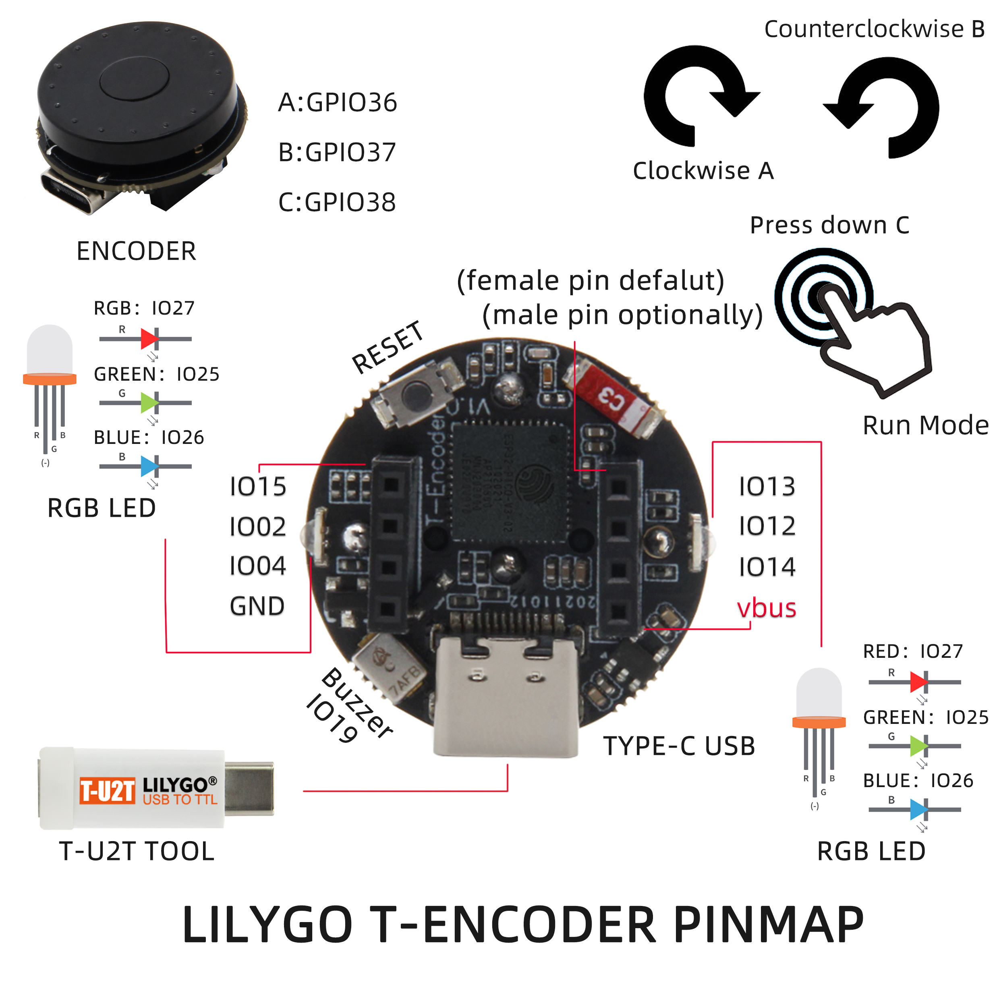

<h1 align = "center">🌟LILYGO T-Encoder🌟</h1>

## **[English](./README.MD) | [中文](./README_CN.MD)**

<h3 align = "left">Quick start:</h3>

**USE Arduino IDE**
1. Install Arduino IDE  [Arduino website](http://www.arduino.cc/en/main/software).
2.  Start Arduino and open Preferences window. In additional board manager add url: https://raw.githubusercontent.com/espressif/arduino-esp32/gh-pages/package_esp32_index.json .separating them with commas.
3. Select Tools -> Board Management -> Search for ESP32 and install
4. Select Tools -> Board -> ESP32 Pico 
5. Copy all the folders in the lib directory to "C:\User\<YourName>\Documents\Arduino\libraries"

**USE PlatformIO**
1. Install VSCode
2. Install the PlatformIO extension in VSCode

<h3 align = "left">Product 📷:</h3>

|  Product  |                            Product  Link                            |
| :-------: | :-----------------------------------------------------------------: |
| T-Encoder | [AliExpress](https://www.aliexpress.com/item/1005003587776302.html) |

## Pinout

