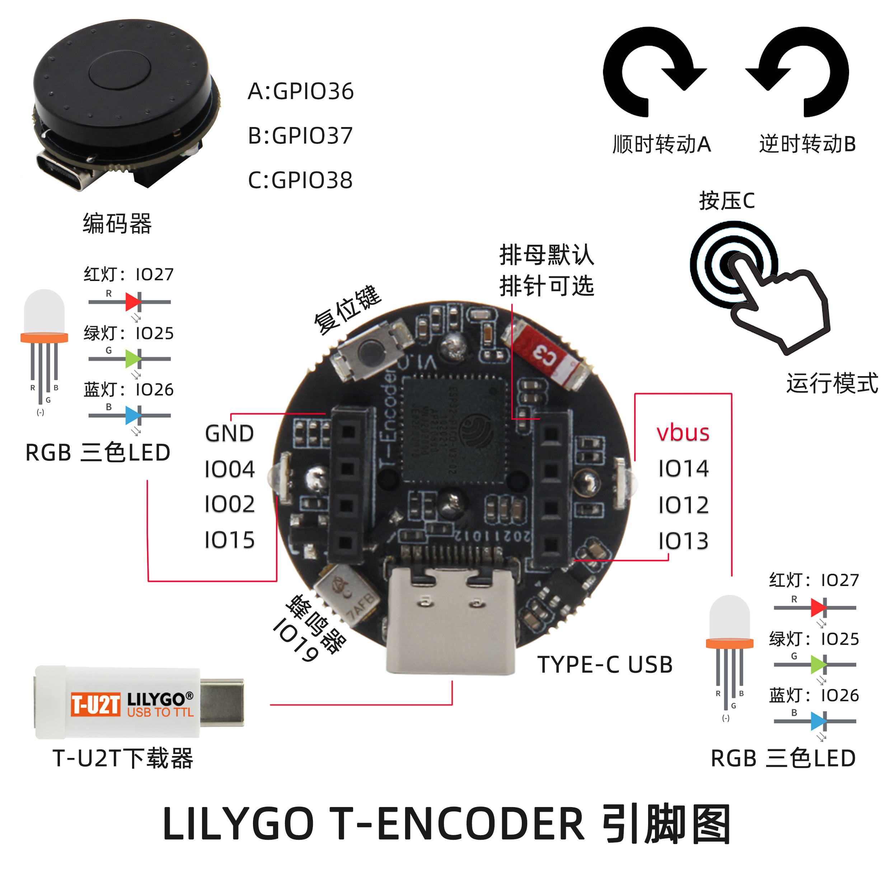

<h1 align = "center">🌟LILYGO T-Encoder🌟</h1>

## **[English](./README.MD) | [中文](./README_CN.MD)**

<h3 align = "left">Quick start:</h3>

**使用Arduino IDE**
1. 安装 Arduino IDE  [Arduino website](http://www.arduino.cc/en/main/software).
2. 打开Arduino，打开“文件” ->“首选项”，附加开发板管理器的url添加: https://raw.githubusercontent.com/espressif/arduino-esp32/gh-pages/package_esp32_index.json 
3. 选择“工具” -> 开发板管理器 -> 搜索ESP32，选择版本并安装
4. 选择“工具” -> 开发板选择 -> ESP32 Pico 
5. 复制lib的文件到  "C:\User\<YourName>\Documents\Arduino\libraries"

**使用PlatformIO**
1. 安装vscode
2. 在vscode安装PlatformIO扩展

<h3 align = "left">Product 📷:</h3>

|  Product  |                                                    Product  Link                                                    |
| :-------: | :-----------------------------------------------------------------------------------------------------------------: |
| T-Encoder | [淘宝](https://item.taobao.com/item.htm?spm=a213gs.20824378.0.0.2d1f4831p4yecp&id=661592187686&qq-pf-to=pcqq.group) |

## Pinout

